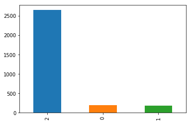
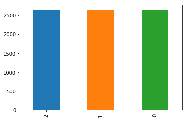

# 05-bag-of-words

## Work outline

* Data preparation
* Performance metrics
* Classificators evaluation on raw data (Baseline)
  * Best estimator
  * Ensemble with tonal classifier
* Classificators evaluation on upsampled data
  * Best estimator
  * Ensemble with tonal classifier
* Classificators evaluation on downsampled data
* Adding more features
* Test performance measures
* Results discussion

## Data preparation
* I've chosen 'Mobile phones' section on rozetka to base my work on.
* All data was scraped using `scrapy`.
* Number of scraped comments: `49890`.
* Number of comments in ukrainian: `10231`.
* Example of comment:
```
{"_": "Пришел не рабочий телефон. Самостоятельно выключается. При включении на экране белая полоска и загрузка идет около 10 минут. Когда захожу в настройки высвечивается белый экран. Полностью бракованый телефон. Куча потраченного времени и сил.", 
 "Переваги:": "Нет", 
 "Недоліки:": "Не рабочий телефон""}'
```
* Mostly all comments in this sections consists of 3 parts:
  * `Main (required)` - this is the main part of comment
  * `Cons (optional)` - some highlighted cons
  * `Pos (optional)` - some highlighted pros
* I've chosen to work only with stemmed words so it would be easy to match words from tonal dictionary

## Performance metrics
This task has 3 classes, so simple f1/prec/rec metrics will not be representative. Also the data is substantially skewed towards the `positive` class. I assume that the end user of this classification will want to find the nagative comments and somehow react to them. He, definitely, will not want to look at enourmous number of positive posts. So our metric will target negative class. In addition, we, really, don't care if some positive class was classified as negative, because it is easy to find such error. On the other side, the cost of not labeling negative comment with negative class is huge, there is just no way for user to find this error in the big pile of positive classes. 

I have chosen `F2` score measured for negative class. Also we will look at other compound metrics (f1_macro) to not make them too bad.

The chosen method of evaluating performance: `3-Fold-Cross-Validation`

## Classificators evaluation on raw data (Baseline)
With a performance metric I've chosen it is hard to find baseline better than some simple classifiers on raw data. 

### Best estimator
The best estimator on raw data is `logistic regression classifier` with:
```f2_score(neg) = 0.2606
f1_macro = 0.4459
```
I take this performance as baseline performance. Also I've tried to use tonal classier on it's own and it didn't give me good results:
```f2_score(neg) = 0.1895
f1_macro = 0.3049
```

### Ensemble with tonal classifier
I've tried to combine Naive Bayes, Logistic Regression and Tonal Classifier in ensemble to make use of tonal dictionary. The strategy for selecting answer was set to `majority`. The results are just a little bit better than baseline (`2% improvement`):
```f2_score(neg) = 0.2656
f1_macro = 0.4413
```

## Classificators evaluation on upsampled data
This dataset is really skewed towards positive class. Let's try to upsample it so all classes will get same number of examples. I'll use just random sampling with replacement.

Before:


After:


### Best estimator
Logistic Regression get the highest scores:
```f2_score(neg) = 0.9911
f1_macro = 0.9587
```

### Ensemble with tonal classifier
Enseble with Naive Bayes, Logistic Regression and Tonal Classifier give results a little bit lower than just Logistic Regression:
```f2_score(neg) = 0.9793
f1_macro = 0.9249
```

## Classificators evaluation on downsampled data
All classificators and ensemble produce much worst performance with downsampled data then with upsampled. 

## Adding more features
So far we were working with main part of comment. It's time to use cons, pros parts. Also, after examining data, the feature that indicates existance of all caps words in ukrainian will help to classify more accurately. I've also prepend `не` to the next 2 word in every example.
Feature example (concatenated vectors):
```[ (main review BOW vector) ... (pros BOW vector) ... (cons BOW vector) ... (has CAPS)]```

Than I trained Logistict Regression with this features on upsampled data. The result was very good:
```f2_score(neg) = 0.9950
f1_macro = 0.9750
```

## Test performance measures
I've the estimator from last paragraph and measured its performance on test set. The results are pretty low:
```f2_score(neg) = 0.5161
f1_macro = 0.5407
```


## Results discussion
* I've obviosly got overfitting problem: there is 9000 features on 8000 examples. It may become better with regularization.
* There are some comments that just asks questions but have 5 star rating. They may make overfitting problem worse
* More uniformly distributed data will probably help
* Things to try:
  * extract word tones as features (definitely will need regularization)
  * different voting strategies in ensemble
  * grid search over huperparameters of the model


